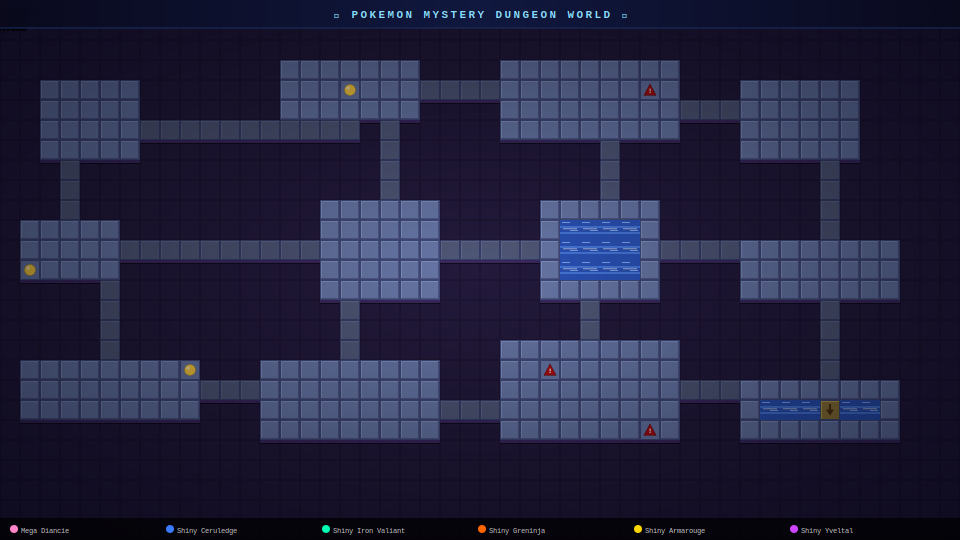

<div align="center">



# PMD SVG World

*A Pokemon Mystery Dungeon-style animated world — autonomous NPCs, Claude agent visualizer, and a self-contained GitHub-embeddable SVG.*

[](index.html)
[](agents.html)
[](https://github.com/PMDCollab/SpriteCollab)

</div>

---

## Feature 1 – Pokemon NPC World (`index.html`)

Autonomous Pokemon NPCs roaming a procedurally generated PMD-style map.

**Pokemon roster:**

| Pokemon | Type | Colour |
|---------|------|--------|
| Mega Diancie | Rock/Fairy | Pink |
| Shiny Ceruledge | Fire/Ghost | Blue |
| Shiny Iron Valiant | Fairy/Fighting | Teal |
| Shiny Greninja | Water/Dark | Orange |
| Shiny Armarouge | Fire/Psychic | Gold |
| Shiny Yveltal | Dark/Flying | Purple |

**Behaviours:** walk · idle · sleep (💤 ZZZ particles) · battle (⚔ spark effects)

**Interactions:** when two Pokemon get close enough they may spontaneously battle — sparks fly, both animate the attack/hurt cycle, then retreat

**Map:** procedural terrain via fBm value noise — grass / water / sand / trees / paths / flowers

---

## Feature 2 – Claude Agent Visualizer (`agents.html`)

Inspired by [pixel-agents](https://github.com/pablodelucca/pixel-agents).
Each Pokemon represents a Claude agent:

| Pokemon | Role | Behaviour |
|---------|------|-----------|
| Shiny Greninja | Agent-1 | Fast, darting work style |
| Shiny Ceruledge | Agent-2 | Precise blade strikes |
| Shiny Armarouge | Agent-3 | Fire-type burst work |
| Shiny Iron Valiant | Agent-4 | Paradox future efficiency |
| Mega Diancie | Orchestrator | Oversees and coordinates |
| Shiny Yveltal | Agent-5 | Wide-sweep coverage |

**Mechanics:**
- **Working** → Pokemon walks to the training dummy and attacks it (HP bar drains, dummy wobbles)
- **Agent interaction** → Two agents collide → battle animation with spark effects
- **Dispatch tasks** from the sidebar — manual or auto-dispatched every 3-6 seconds
- **Live activity log** with timestamps

---

## VSCode Extension

Open the Agent Visualizer directly inside VS Code via the **PMD Agent World** panel.

```
Extensions → PMD Pokemon Agent World → PMD: Open Agent World
```

Supports live task dispatch from the Command Palette (`Ctrl+Shift+P → PMD: Dispatch Task`).

---

## Running

```bash
npm start
# → http://localhost:3000
```

### Regenerate the README SVG

```bash
node generate-svg.mjs
# → assets/pokemon-world.svg
```

Sprites load from [PMDCollab SpriteCollab](https://github.com/PMDCollab/SpriteCollab) over the network.
Coloured shape fallbacks render when sprites are unavailable (e.g. GitHub CSP).

---

## Asset sources

| Asset | Source |
|-------|--------|
| Pokemon sprites | [PMDCollab/SpriteCollab](https://github.com/PMDCollab/SpriteCollab) |
| Tileset style | [PMD Map Generator](https://raks-olho.itch.io/pokemon-mystery-dungeon-map-generator) |
| Agent concept | [pixel-agents](https://github.com/pablodelucca/pixel-agents) |

## Sprite URL format

```
# Normal:  sprite/{ID}/{Animation}-Anim.png
# Shiny:   sprite/{ID}/Shiny/{Animation}-Anim.png
# Mega:    sprite/{ID}/{Form}/{Animation}-Anim.png
```

Base: `https://raw.githubusercontent.com/PMDCollab/SpriteCollab/master/`

---

## Roadmap

- [x] Animated SVG export for GitHub profile embedding
- [x] VSCode extension panel
- [ ] Day/night cycle
- [ ] More interaction types (wave, emote, trade)
- [ ] Claude Code transcript integration for real-time agent activity
- [ ] SMIL fallback animations for broader SVG compatibility
